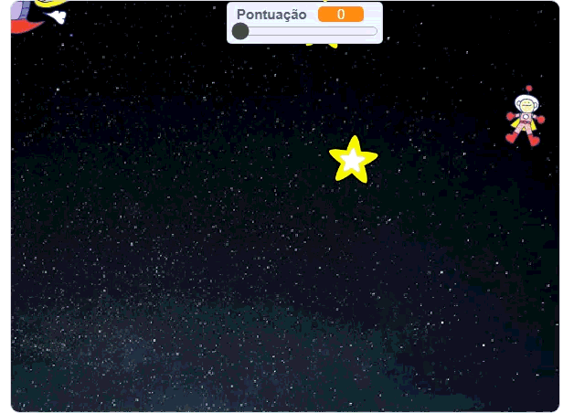
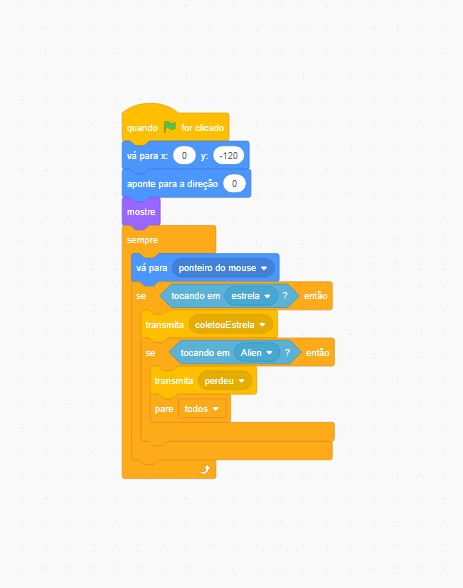
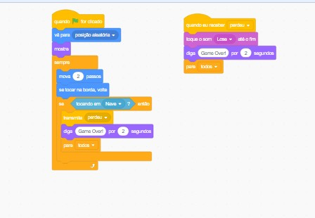
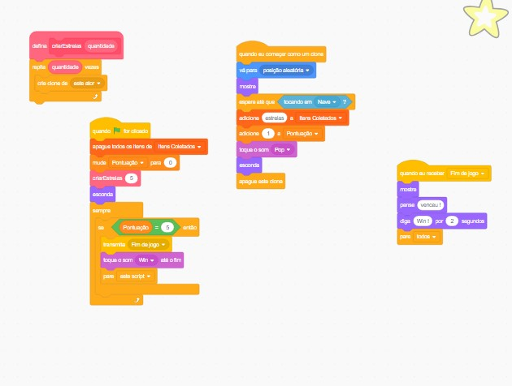

# 🚀 Jogo Scratch - Coletar Estrelas (Desafio Kodland)

Este projeto é um **jogo desenvolvido no Scratch** como parte do desafio prático para **tutor da Kodland**.  
O objetivo do jogo é **controlar uma nave, desviar de inimigos e coletar estrelas** para ganhar pontos.

✅ Inclui **recursos educacionais**, lógica para clones, variáveis, listas e blocos personalizados.

---

## ✅ Funcionalidades do Jogo
- ✔ Controle da nave com teclas de **setas esquerda/direita**
- ✔ Disparo de **tiros** com tecla **espaço**
- ✔ **Inimigos gerados com clones** (Alienígenas)
- ✔ Sistema de **pontuação** e **vidas**
- ✔ Condições de **Vitória** e **Game Over**
- ✔ **Bloco personalizado com parâmetro numérico**
- ✔ Tela de **instruções**

---

## 🎮 Como Jogar
1. **Mover nave** → Use as setas **←** e **→**
2. **Atirar** → Pressione **ESPAÇO**
3. **Objetivo** → Derrube os aliens e acumule pontos sem perder todas as vidas.

---

## 🖼 Prévia do Jogo
### ✅ Vitória

### ❌ Derrota

---

## 🧩 Estrutura dos Blocos
### 🔹 Blocos da Nave:

### 🔹 Blocos do Alien:

### 🔹 Blocos da Estrela:

---

## 🗂 Estrutura do Projeto

scratch-jogo-alien-desafio-kodland/
│
├── coletar_estrelas_Kodland.sb3 # Arquivo do jogo Scratch
├── naveblocos.jpg # Blocos da nave
├── alien_blocos.jpg # Blocos do inimigo
├── estrelablocos.jpg # Blocos da estrela
├── wingif.gif # GIF do jogo vencendo
└── losergif.gif # GIF do jogo perdendo

---

## ▶ Como Abrir o Jogo
1. Acesse [Scratch Online](https://scratch.mit.edu/projects/editor/)
2. Clique em **Carregar do computador**
3. Selecione o arquivo `.sb3`.

---

## 🔗 Repositório no GitHub
[**Clique aqui para acessar o projeto**](https://github.com/Cor4l92/scratch-jogo-alien-desafio-kodland)

---

## 👨‍💻 Autor
**Sandro Luis de Paula Junior**  
📌 [GitHub](https://github.com/Cor4l92)  
📌 [LinkedIn](https://linkedin.com/in/sandro-junior-084035164)

---

## 🏁 Licença
Uso livre para fins educacionais.  
Pode modificar e compartilhar!
